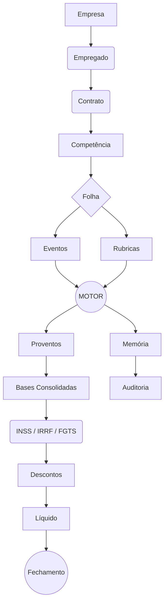

# Especificação Técnica: Motor de Folha de Pagamento CLT 2026 & Módulo de Rubricas

## 1. OBJETIVO DO DOCUMENTO
O objetivo é especificar a construção de um **Motor de Cálculo de Folha de Pagamento CLT**, integrado diretamente ao módulo de **Rubricas**.

O sistema deve ser capaz de calcular corretamente:
- folha mensal;
- adiantamento salarial;
- férias;
- 13º salário;
- rescisão;
- folha complementar;
- diferenças salariais;
- dissídio;
- descontos;
- INSS;
- IRRF;
- FGTS;
- encargos patronais;
- bases de cálculo;
- eventos automáticos;
- eventos manuais;
- memória de cálculo;
- auditoria;
- fechamento e reabertura da folha.

O documento deixa extremamente claro que:
> **Rubrica não é apenas uma descrição de um valor.**

A rubrica representa uma regra parametrizada que informa ao motor:
- o que está sendo calculado;
- como calcular;
- sobre qual base calcular;
- quais incidências possui;
- quando é válida;
- qual natureza possui;
- se é automática ou manual;
- sua ordem de cálculo;
- suas dependências;
- como impacta INSS, IRRF, FGTS e encargos patronais.

---

## 2. FONTES LEGAIS
O motor utiliza como referência prioritária fontes oficiais brasileiras. As regras precisam ser **parametrizadas e versionadas**, nunca espalhadas de forma *hardcoded* pelo código.

Priorizar:
- Constituição Federal;
- CLT;
- Lei 8.212/1991 (Custeio da Seguridade Social);
- Lei 8.036/1990 (FGTS);
- Lei 12.506/2011 (Aviso Prévio Proporcional);
- Lei 9.250/1995 (IRPF);
- Legislação do 13º salário e férias;
- Legislação de rescisão;
- Portarias oficiais do INSS e tabelas oficiais da Receita Federal;
- eSocial (Tabela 3 - Natureza das Rubricas).

O sistema deve permitir atualização futura das regras sem necessidade de reescrever o motor.

---

## 3. INSS — TABELA 2026
A tabela de contribuição do empregado válida em 2026 obedece à seguinte estrutura progressiva:

| Faixa                     | Alíquota |
| ------------------------- | -------: |
| Até R$ 1.621,00           |     7,5% |
| R$ 1.621,01 a R$ 2.902,84 |       9% |
| R$ 2.902,85 a R$ 4.354,27 |      12% |
| R$ 4.354,28 a R$ 8.475,55 |      14% |

**Teto da base previdenciária: R$ 8.475,55**

**IMPORTANTE:**
O motor NÃO pode aplicar simplesmente `salário × alíquota da faixa`. A contribuição deve ser progressiva.

O algoritmo deve utilizar lógica equivalente a:
```text
faixa1 = mínimo(base, 1621.00)
faixa2 = máximo(mínimo(base, 2902.84) - 1621.00, 0)
faixa3 = máximo(mínimo(base, 4354.27) - 2902.84, 0)
faixa4 = máximo(mínimo(base, 8475.55) - 4354.27, 0)

INSS = (faixa1 × 7,5%) + (faixa2 × 9%) + (faixa3 × 12%) + (faixa4 × 14%)
```
O cálculo deve respeitar o teto de R$ 8.475,55.

**Regras acessórias documentadas e parametrizadas:**
- Múltiplos vínculos (abatimento da base já retida).
- Contribuição já realizada (múltiplos pagamentos no mesmo mês).
- Limite mensal.
- 13º salário calculado separadamente.
- Arredondamentos e Diferenças.
- Folha complementar.

---

## 4. IRRF — TABELA 2026
A tabela mensal de IRPF 2026:

| Base de cálculo mensal    | Alíquota | Parcela a deduzir |
| ------------------------- | -------: | ----------------: |
| Até R$ 2.428,80           |       0% |           R$ 0,00 |
| R$ 2.428,81 a R$ 2.826,65 |     7,5% |         R$ 182,16 |
| R$ 2.826,66 a R$ 3.751,05 |      15% |         R$ 394,16 |
| R$ 3.751,06 a R$ 4.664,68 |    22,5% |         R$ 675,49 |
| Acima de R$ 4.664,68      |    27,5% |         R$ 908,73 |

- **Dependente:** R$ 189,59 por dependente/mês.
- **Dedução simplificada mensal:** R$ 607,20.

**Nova redução do IRPF de 2026:**
- Rendimentos tributáveis mensais até R$ 5.000,00 → redução suficiente para zerar o imposto.
- De R$ 5.000,01 até R$ 7.350,00 → redução progressiva.
- Acima de R$ 7.350,00 → sem redução.

Fórmula oficial da redução (quando aplicável):
```text
redução = 978,62 - (0,133145 × rendimento tributável mensal)
```

**IMPORTANTE:**
O motor deve comparar: `deduções legais VERSUS dedução simplificada` e utilizar a alternativa **legalmente mais vantajosa para o trabalhador**.
Nunca implementar IRRF apenas como `salário × alíquota`.

---

## 5. PRINCÍPIO FUNDAMENTAL DO SISTEMA
Relação fundamental arquitetural:
```text
RUBRICA      → define O QUE é o evento
EVENTO       → define QUANTO e QUANDO aconteceu
MOTOR        → define COMO calcular
TABELA LEGAL → define COMO tributar
FOLHA        → registra o RESULTADO
MEMÓRIA      → explica COMO o resultado foi obtido
```

---

## 6. DIFERENÇA ENTRE RUBRICA E EVENTO
- **Rubrica (A Regra):**
  Ex: `1005 — Hora Extra 50%`
  Ela define:
  `tipo = PROVENTO`, `categoria = HORA_EXTRA`, `percentual = 50`, `incide_inss = true`, `incide_irrf = true`, `incide_fgts = true`.
- **Evento (A Ocorrência):**
  Ex: `empregado = João`, `rubrica = 1005`, `quantidade = 10 horas`, `competência = 09/2026`.
- **Motor:** Calcula `valor_hora × 1,50 × 10`.

---

## 7. TELA DE RUBRICAS
Especificação completa de UI/UX para listagem.
- **Filtros:** código, nome, tipo, categoria, status, incidência (INSS/IRRF/FGTS), origem, vigência.
- **Colunas da Grid:** Código | Nome | Tipo | Categoria | Incidências | Origem | Vigência | Status | Ações.
- **Ações:** Visualizar, Editar, Duplicar, Inativar, Histórico, Incidências, Fórmula, Testar, Visualizar Utilização.

---

## 8. FORMULÁRIO DA RUBRICA (Abas de Configuração)
### ABA 1 — IDENTIFICAÇÃO
**Campos:** Código, Nome, Descrição, Tipo, Categoria, Natureza eSocial, Status, Origem.
**Tipos:** PROVENTO, DESCONTO, BASE, INFORMATIVA.
**Categorias:** SALARIO, HORA_EXTRA, ADICIONAL, DSR, COMISSAO, GRATIFICACAO, FERIAS, 13_SALARIO, RESCISAO, BENEFICIO, PREVIDENCIA, IRRF, FGTS, PENSAO, ADIANTAMENTO, OUTROS.

---

## 9. ABA CÁLCULO
**Campos:** Forma de cálculo, Base de cálculo, Percentual, Quantidade, Unidade, Divisor, Fator, Fórmula, Ordem de cálculo, Arredondamento.
**Formas de cálculo:** FIXO, PERCENTUAL, QUANTIDADE_X_VALOR, DIAS, HORAS, FORMULA, REFERENCIA, BASE, MANUAL, AUTOMATICA.

**Exemplos de parametrização:**
- *Salário:* forma = DIAS, base = SALARIO_CONTRATUAL, divisor = 30
- *Hora Extra:* forma = HORAS, base = VALOR_HORA, percentual = 50
- *Adicional:* forma = PERCENTUAL, base = SALARIO_BASE, percentual = 20

---

## 10. ABA INCIDÊNCIAS
A rubrica deve possuir *flags* independentes. Nenhuma incidência infere automaticamente a outra.
```text
incide_inss, incide_irrf, incide_fgts
incide_inss_patronal, incide_rat, incide_terceiros
gera_base_inss, gera_base_irrf, gera_base_fgts
```

---

## 11. ABA VIGÊNCIA
**Campos:** `vigencia_inicio`, `vigencia_fim`, `versao`, `motivo_alteracao`.
**Regra:** NUNCA apagar uma regra antiga utilizada por uma folha fechada. Se uma rubrica mudar em 2027:
- Versão 1 → válida até 31/12/2026.
- Versão 2 → válida a partir de 01/01/2027.

---

## 12. ABA NATUREZA / ESOCIAL
**Campos:** `codigo_natureza`, `descricao_natureza`, `inicio_vigencia`, `fim_vigencia`.
A natureza eSocial deve seguir a Tabela 3 rigorosamente e ser versionada.

---

## 13. ABA TESTE DA RUBRICA
Área de simulação isolada na UI que não grava no banco de dados.
- *Input:* Salário base: R$ 3.000,00 | Quantidade: 10 | Percentual: 50%.
- *Output esperado:* Base calculada, Fórmula aplicada, Resultado financeiro, e demonstração das incidências INSS/IRRF/FGTS geradas.

---

## 14. RUBRICAS AUTOMÁTICAS E MANUAIS
- **AUTOMÁTICA:** Gerada exclusivamente pelo motor (Ex: salário, INSS, IRRF, FGTS, 1/3 de férias, 13º). O usuário não pode sobrescrever o valor diretamente sem um evento de ajuste explícito.
- **MANUAL:** Lançada pelo usuário ou via API externa (Ex: bônus, comissão, faltas, pensão, ajuda de custo).

---

## 15. EVENTOS DA FOLHA
Tabela `eventos_folha` representa a instância da rubrica para um empregado.
**Campos:** `id`, `folha_id`, `empregado_id`, `rubrica_id`, `quantidade`, `referencia`, `valor_manual`, `origem`, `observacao`, `data_lancamento`, `usuario_lancamento`.
**Origem:** MANUAL, AUTOMATICA, IMPORTACAO, INTEGRACAO, COMPLEMENTAR, DISSIDIO, RESCISAO, FERIAS.

---

## 16. MOTOR DE CÁLCULO (Pipeline)
Arquitetura em estágios sequenciais (`PayrollEngine`):
```text
LoadContext -> LoadRubrics -> LoadLegalTables -> ProcessManualEvents -> GenerateAutomaticEvents ->
CalculateSalary -> CalculateAdditions -> CalculateOvertime -> CalculateDSR -> CalculateVacation ->
Calculate13th -> CalculateTermination -> BuildBases -> CalculateINSS -> CalculateIRRF ->
CalculateFGTS -> CalculateEmployerCharges -> CalculateDeductions -> CalculateAdvances ->
CalculateNet -> Validate -> GenerateMemory
```

---

## 17. CONTEXTO DO MOTOR
Objeto em memória injetado ao iniciar o cálculo: `PayrollContext`.
Contém: `competencia`, `tipo_folha`, `empresa`, `empregado`, `contrato`, `rubricas`, `eventos`, `tabelas_legais`, `dependentes`, `ferias`, `rescisao`, `avisos_previos`, `adiantamentos`, `configuracoes_empresa`.

---

## 18. ORDEM DE EXECUÇÃO
A ordem deve ser **determinística e protegida**.
1. Carregar contexto
2. Validar empregado
3. Carregar contrato
4. Carregar rubricas vigentes
5. Carregar eventos manuais
6. Gerar eventos automáticos
7. Calcular salário
8. Calcular adicionais
9. Calcular horas extras
10. Calcular DSR
11. Calcular férias
12. Calcular 13º
13. Calcular rescisão
14. Consolidar proventos
15. Construir bases
16. Calcular INSS
17. Calcular IRRF
18. Calcular FGTS
19. Calcular encargos patronais
20. Calcular descontos
21. Compensar adiantamentos
22. Calcular líquido
23. Validar
24. Gerar memória
25. Persistir resultado

---

## 19. DEPENDÊNCIAS ENTRE RUBRICAS (DAG)
Exemplo de fluxo de dependência:
`SALARIO_BASE -> VALOR_HORA -> HORA_EXTRA -> DSR -> BASE_INSS -> INSS`

Cada rubrica possui `ordem_calculo` e `dependencias`.
**Prevenção:** O sistema DEVE detectar dependências circulares (A -> B -> C -> A) em tempo de configuração e bloquear o cálculo se encontrar um ciclo (Grafo Acíclico Dirigido).

---

## 20. FÓRMULAS E INTERPRETADOR
**PROIBIDO:** O uso de `eval()`, `Function()`, `SQL dinâmico` ou injeção arbitrária para executar fórmulas.
O motor deve usar uma DSL segura (AST Parser).
**Variáveis permitidas:** `SALARIO_BASE`, `SALARIO_CONTRATUAL`, `DIAS_TRABALHADOS`, `HORAS_TRABALHADAS`, `VALOR_HORA`, `BASE_INSS`, `BASE_IRRF`, `BASE_FGTS`, `DEPENDENTES`, `VALOR_INSS`, `VALOR_IRRF`, `VALOR_FGTS`.
**Operadores:** `+`, `-`, `*`, `/`, `%`, `MIN()`, `MAX()`, `IF()`, `ROUND()`.

---

## 21. SALÁRIO MENSAL
Cálculo base: `valor_dia = salario / 30`.
Para salário proporcional: `salario_proporcional = (salario / 30) × dias_devidos`.
Exemplo: Salário R$ 3.000, 20 dias trabalhados → 3000 / 30 * 20 = R$ 2.000.
O controle de dias processa abatimentos separados por: faltas, afastamentos, férias, admissão/demissão.

---

## 22. HORAS EXTRAS
Divisor é configurável por contrato (não assumir 220 universalmente).
- `valor_hora = salario / divisor`
- Hora extra 50%: `valor_hora × 1,50 × quantidade`
- Hora extra 100%: `valor_hora × 2,00 × quantidade`

---

## 23. DSR (Descanso Semanal Remunerado)
Cálculo obrigatório sobre: horas extras, comissões, adicionais (noturno, periculosidade).
A fórmula de DSR não é fixa/universal; deve ser parametrizada conforme a verba (ex: `(valor / dias_uteis) * dias_inativos`).

---

## 24. FÉRIAS
O motor controla: `período aquisitivo`, `período concessivo`, `dias de direito`, `dias gozados`, `abono pecuniário`, `remuneração`, `1/3 constitucional`.
- Base férias: `ferias = remuneracao_base × dias / 30`
- 1/3 Férias: `terco = ferias / 3`
As rubricas de férias devem ser tratadas e calculadas separadamente da folha normal, mas processadas na mesma competência.

---

## 25. 13º SALÁRIO
Suporte a: `primeira parcela`, `segunda parcela`, `13º proporcional`, `13º na rescisão`.
Cálculo proporcional: `13 = remuneracao_base × avos / 12`
O 13º **NÃO** compartilha base previdenciária (INSS) com a folha mensal. A base deve ser tributada e recolhida de forma isolada, gerando rubricas exclusivas de tributo para 13º.

---

## 26. ADIANTAMENTO SALARIAL
O adiantamento **NÃO** é um segundo salário, é um pagamento antecipado.
- *Folha de Adiantamento:* Provento de adiantamento pago (Ex: R$ 1.200).
- *Folha Mensal:* Provento (Salário = R$ 3.000) e Desconto (Desconto Adiantamento = R$ 1.200).
A tabela de controle deve impedir dupla dedução via `adiantamento_id`, vinculando o estorno ao desembolso original.

---

## 27. RESCISÃO
Deve suportar fluxos modulares para: `RESCISAO_SEM_JUSTA_CAUSA`, `PEDIDO_DE_DEMISSAO`, `JUSTA_CAUSA`, `TERMINO_CONTRATO_PRAZO_DETERMINADO`, `RESCISAO_ACORDO_ART_484_A`.
Nunca utilizar um único `if/else` gigante; usar *Strategy Pattern* para lidar com as diferenças de indenização e elegibilidade.

---

## 28. COMPONENTES DA RESCISÃO
Verbas a serem calculadas (como rubricas independentes): saldo de salário, aviso prévio trabalhado/indenizado, 13º proporcional, férias vencidas/proporcionais/indenizadas, 1/3 de férias, multa FGTS, faltas, compensação de adiantamentos.

---

## 29. AVISO PRÉVIO
Tipos: `TRABALHADO`, `INDENIZADO`.
Controles: `data_inicio`, `data_fim`, `dias_aviso`, `dias_trabalhados`, `dias_indenizados`.
Aplicar Lei 12.506/2011 (proporcionalidade de +3 dias por ano completo). Não assumir *hardcoded* 30 dias.

---

## 30. ACORDO ENTRE AS PARTES (Art 484-A CLT)
Regras exclusivas da modalidade:
- Aviso prévio indenizado: devido pela metade (50%).
- Multa FGTS: 20% (e não 40%).
- Saque FGTS: restrito a 80%.
- Sem direito a Seguro-Desemprego.
O motor aciona essas reduções via parametrização, não via código chumbado.

---

## 31. CONTRATO POR PRAZO DETERMINADO
Lógica separada para: término normal, rescisão antecipada pelo empregador (Art 479 - multa 50% dos dias faltantes), rescisão antecipada pelo empregado (Art 480 - desconto até o limite do Art 479).

---

## 32. FGTS
Rubricas segregadas: `BASE_FGTS`, `VALOR_FGTS` (Depósito).
O FGTS Patronal **NUNCA** pode ser incluído no bloco de "Descontos" do holerite/demonstrativo financeiro do empregado; ele é encargo e não afeta o salário líquido (exceto em casos judiciais específicos, irrelevantes para o padrão).

---

## 33. ENCARGOS PATRONAIS
Suporte obrigatório a: INSS patronal, RAT, FAP, Terceiros, FGTS mensal/rescisório.
A configuração busca dados combinando: empresa, regime tributário (Simples Nacional vs Lucro Presumido/Real), FPAS, RAT e FAP histórico.

---

## 34. BASES DE CÁLCULO
Tabela/estrutura independente de totalizadores: `BASE_INSS`, `BASE_IRRF`, `BASE_FGTS`, `BASE_INSS_PATRONAL`, `BASE_RAT`, `BASE_TERCEIROS`. As bases precisam estar prontas no pipeline (etapa 15) ANTES de calcular os impostos (etapas 16-18).

---

## 35. MEMÓRIA DE CÁLCULO (Auditoria Fina)
Funcionalidade **OBRIGATÓRIA** para *compliance*.
Estrutura: `id`, `folha_id`, `empregado_id`, `rubrica_id`, `etapa`, `base`, `quantidade`, `percentual`, `formula_parseada`, `valor_resultado`, `origem`, `timestamp`.
*Exemplo prático de registro:*
- Rubrica: Hora Extra 50%
- Valores: Salário = R$ 3.000 / Divisor = 220 -> Valor_Hora = 13,636363
- Expressão Salva: `13,636363 × 1,50 × 10 = R$ 204,55`
O Frontend lê isso no modal "Como este valor foi calculado?".

---

## 36. PRECISÃO MONETÁRIA
**REGRA CRÍTICA:** NUNCA utilizar `float` (ponto flutuante binário).
- Utilizar objetos de precisão decimal arbitrária (`Decimal`, `BigDecimal`).
- Banco de Dados: `DECIMAL(18,2)` para saldos financeiros. `DECIMAL(18,6)` para fatores, índices e cálculos intermediários (divisor, valor hora).
- Centralizar o arredondamento: `MoneyRound()`.

---

## 37. SNAPSHOT DA FOLHA
Uma vez fechada, a folha copia/serializa o *estado legal* do mundo naquele momento (salário, dependentes, cargo, tabelas legais, rubricas vigentes). Garante que recalcular uma folha de Jan/2026 no ano de 2030 chegue ao MESMO centavo.

---

## 38. VERSIONAMENTO DO MOTOR
Cada folha gerada carimba:
`versao_motor` (ex: 1.4.0), `versao_regras` (ex: 2026.09), `versao_rubricas` (ex: 2026.01.v5).
Nunca recalcular folha histórica com o motor novo sem aviso expresso e criação de retificadora.

---

## 39. ESTRUTURA DO BANCO DE DADOS
Tabelas necessárias:
- `empresas`, `empregados`, `contratos`, `dependentes`.
- `folhas` (cabecalho da competencia), `folha_empregados` (holerite).
- `rubricas`, `rubrica_vigencias`.
- `eventos_folha` (lancamentos brutos), `bases_folha`, `calculos_folha` (valores finas).
- `memorias_calculo`.
- `tabelas_inss`, `tabelas_irrf`, `tabelas_reducao_irrf`, `tabelas_fgts`, `regras_encargos`.
- `ferias`, `periodos_aquisitivos`, `rescisoes`, `avisos_previos`, `adiantamentos`.
- `auditoria_folha`.

---

## 40. ESTADOS DA FOLHA
Máquina de estados (FSM):
`RASCUNHO` → `CALCULADA` → `CONFERENCIA` → `FECHADA` → `REABERTA` → `CANCELADA`.
O estado `FECHADA` bloqueia mutações na tabela de cálculo e eventos. Reabertura requer log de auditoria.

---

## 41. FOLHA COMPLEMENTAR
- Processamento delta.
- Dados: `folha_origem_id`, `motivo`, `competencia_origem`, `competencia_pagamento`, `rubricas_afetadas`, `diferenca`.
Ex: Salário Correto = 3.300 | Salário Pago = 3.000 -> Diferença = R$ 300.
Gera recálculo dos reflexos (INSS, IRRF, FGTS) sobre a diferença, guardando as alíquotas da época original.

---

## 42. DISSÍDIO (Reajuste Coletivo)
Parametrização: `percentual_reajuste`, `data_efeito`, `competencias_afetadas`, `salario_anterior`, `salario_novo`.
Gera cálculos de diferença para cada folha afetada retroativamente (horas extras, DSR, férias, encargos).

---

## 43. VALIDAÇÕES ANTES DO FECHAMENTO (Hard Blocks)
Bloquear mudança de status se:
- Empregado não possui contrato válido.
- Rubricas usadas não têm vigência válida na competência.
- Bases de impostos não foram consolidadas.
- INSS/IRRF é negativo.
- Teto do INSS foi violado (base de incidência maior que o limite sem múltiplos vínculos).
- Adiantamento sem registro de origem.
- Memória de cálculo vazia.
Retornar array estruturado com erros descritivos.

---

## 44. AUDITORIA (Trails)
Log universal em `auditoria_folha`: `usuario`, `data_hora`, `acao`, `entidade`, `entidade_id`, `valor_anterior`, `valor_novo`, `motivo`, `versao_motor`. Monitoramento especial em: fechamento, reabertura, mudança de salário, alteração de incidência de rubrica e cálculos manuais.

---

## 45. TESTES AUTOMATIZADOS (Matriz de Homologação)
**Testes de limites exatos obrigatórios:**
- **INSS**: 1621.00, 1621.01, 2902.84, 2902.85, 4354.27, 4354.28, 8475.55, 8475.56
- **IRRF**: 2428.80, 2428.81, 2826.65, 2826.66, 3751.05, 3751.06, 4664.68, 4664.69, 5000.00, 5000.01, 7350.00, 7350.01
- **Cenários de Folha**: Salário integral, admissão/demissão no meio do mês, faltas, horas extras + DSR, férias atravessando o mês, 13º.

---

## 46. EXEMPLO DE RUBRICA (JSON)
```json
{
  "codigo": "1001",
  "nome": "Salário Base",
  "tipo": "PROVENTO",
  "categoria": "SALARIO",
  "forma_calculo": "DIAS",
  "ordem_calculo": 10,
  "incidencias": {
    "incide_inss": true,
    "incide_irrf": true,
    "incide_fgts": true,
    "gera_base_inss": true,
    "gera_base_irrf": true,
    "gera_base_fgts": true
  },
  "vigencias": [
    {
      "inicio": "2026-01-01",
      "fim": null,
      "versao": "1.0",
      "natureza_esocial": "1000"
    }
  ]
}
```
*(O modelo se repete, com as devidas alterações booleanas e de cálculo, para rubricas de horas extras, férias, IRRF, descontos e tributos).*

---

## 47. EXEMPLO COMPLETO DO MOTOR
**Contexto**: Salário R$ 3.000 / 30 dias trabalhados / 1 dependente / 10 Horas Extras 50% / R$ 1.000 Adiantamento.

1. `salário`: 3000,00
2. `valor_hora`: 3000 / 220 = 13,636363
3. `hora_extra_50`: 13,636363 * 1,5 * 10 = 204,55
4. `proventos`: 3204,55
5. `base_INSS`: 3204,55
6. `INSS_calc`:
   Faixa 1: 1621,00 * 7,5% = 121,57
   Faixa 2: (2902,84 - 1621,00) * 9% = 115,36
   Faixa 3: (3204,55 - 2902,84) * 12% = 36,20
   Total INSS = R$ 273,13
7. `base_IRRF_legal`: 3204,55 - 273,13 (INSS) - 189,59 (Dep) = 2741,83
8. `base_IRRF_simplif`: 3204,55 - 607,20 (Simp) = 2597,35 (Vantajosa para IRRF nulo/menor? Não, a simplificada diminui mais a base. Calculando sobre 2597,35)
   `IRRF_calc_simplif`: 2597,35 * 7,5% = 194,80 - 182,16 (Parcela Dedução) = 12,64
   Redução 2026 aplicável? Rendimento até 5.000,00 -> Reduz imposto a zero. IRRF = 0,00.
9. `FGTS`: 3204,55 * 8% = 256,36 (Encargo)
10. `desconto_adiantamento`: 1000,00
11. `liquido`: 3204,55 - 273,13 - 1000,00 - 0,00 = 1931,42

---

## 48. ARQUITETURA DE CÓDIGO (Referência)
```text
/payroll
    /engine (PayrollEngine, PayrollContext, CalculationResult, CalculationMemory)
    /rubrics (RubricService, RubricValidator, RubricFormulaParser)
    /legal (INSSCalculator, IRRFCalculator, FGTSCalculator, LegalTableService)
    /calculations (SalaryCalculator, OvertimeCalculator, DSRCalculator, VacationCalculator, TerminationCalculator)
    /bases (INSSBaseBuilder, IRRFBaseBuilder, FGTSBaseBuilder)
    /validation (PayrollValidator)
    /audit (PayrollAuditService)
```

---

## 49. SEPARAÇÃO ENTRE FRONTEND E MOTOR
O frontend atua exclusivamente como **camada de apresentação e disparo**.
Ele: cadastra, consulta, envia eventos, solicita cálculo e exibe o resultado.
O backend/motor realiza as operações atômicas de folha, tributação, persistência e auditoria. Regras trabalhistas NUNCA devem estar duplicadas ou implementadas em JS/React no lado do cliente.

---

## 50. PRINCÍPIO DE CONFIGURAÇÃO (Sem Magic Numbers)
Valores como `1621`, `2902.84`, `4354.27`, `8475.55` estão banidos do código-fonte.
Eles residem no banco (`tabelas_inss`, `tabelas_irrf`, etc) e são lidos via `LegalTableService` com base na `vigencia_inicio` da competência calculada.

---

## 51. NÃO FAÇA ISSO (Regras que o agente de IA não pode violar)
- Não usar `float` para dinheiro.
- Não usar `eval()`.
- Não colocar regras de INSS ou IRRF no frontend.
- Não apagar tabelas legais antigas (inativar, nunca dar `DELETE`).
- Não alterar folha fechada diretamente.
- Não calcular INSS usando apenas uma alíquota bruta (esquecendo as faixas).
- Não misturar 13º com folha mensal para fins de IR e INSS.
- Não tratar FGTS patronal como desconto do empregado.
- Não usar um único fluxo de cálculo para todas as rescisões.
- Não permitir fórmula arbitrária rodando no servidor.
- Não permitir edição silenciosa de cálculo (sem gerar auditoria/memória).
- Não salvar somente o salário líquido no banco; guarde toda a matriz.
- Não remover memória de cálculo nas reciclagens da folha.
- Não sobrescrever regras históricas vigentes.
- Não criar cálculo sem carimbo de versão.
- Não duplicar regras trabalhistas em múltiplos microsserviços.

---

## 52. FLUXO COMPLETO (Mermaid)


---

## 53. MODELO DE RESULTADO
O output final do motor é um JSON imutável (CalculationResult):
```json
{
  "total_proventos": 3204.55,
  "total_descontos": 1273.13,
  "total_inss": 273.13,
  "total_irrf": 0.00,
  "total_fgts": 256.36,
  "total_encargos_patronais": 890.50,
  "liquido": 1931.42,
  "bases": {
    "inss": 3204.55,
    "irrf": 2597.35,
    "fgts": 3204.55
  },
  "memoria_calculo_id": "uuid-v4-abc",
  "status": "CALCULADA"
}
```

---

## 54. EXPERIÊNCIA DO USUÁRIO
Ao interagir com os holerites, as APIs do backend suportam:
- Calcular / Recalcular folha inteira ou unitária.
- Visualizar memória, bases e incidências de cada verba (drill-down).
- Comparativo *diff* entre folha calculada atual vs versão fechada do mês anterior.
Ao clicar em uma rubrica na UI ("Como este valor foi calculado?"), a API devolve o *node* exato do Grafo de Memória, detalhando os percentuais, fórmula explícita aplicada e as dependências legais.

---

## 55. COMO O AGENTE DEVE IMPLEMENTAR (Roadmap de Construção)
Instrução sequencial rígida para o agente/programador:
1. Analisar banco atual.
2. Identificar estrutura existente de empregados.
3. Identificar contratos.
4. Identificar módulo folha base.
5. Identificar rubricas existentes.
6. Identificar eventos lançados.
7. Identificar tabelas legais.
8. Mapear e preservar funcionalidades existentes (evitar quebras).
9. Corrigir/adequar modelagem de Rubricas para a estrutura proposta.
10. Criar integração Rubricas → Eventos.
11. Criar integração Eventos → Motor `PayrollEngine`.
12. Implementar acumuladores de bases (INSS, IRRF, FGTS).
13. Implementar `INSSCalculator`.
14. Implementar `IRRFCalculator` (com Redução de 2026).
15. Implementar `FGTSCalculator`.
16. Implementar regras de férias.
17. Implementar regras de 13º.
18. Implementar lógica de Adiantamento Salarial.
19. Implementar classes de Rescisão (Strategy).
20. Implementar Folha Complementar.
21. Implementar Dissídio e Diferenças Salariais.
22. Acoplar geração de Memória em cada estágio do Pipeline.
23. Implementar Auditoria transacional.
24. Escrever Testes Unitários e de Integração (Matriz Legal 2026).
25. SOMENTE DEPOIS otimizar e melhorar a interface gráfica.

---

## 56. REGRA DE OURO
Antes de implementar qualquer cálculo trabalhista, identifique com precisão cristalina as seguintes perguntas:
1. **QUAL É A RUBRICA?**
2. **QUAL É O EVENTO?**
3. **QUAL É A BASE?**
4. **QUAL É A INCIDÊNCIA?**
5. **QUAL É A REGRA LEGAL APLICÁVEL?**
6. **QUAL É A VIGÊNCIA DESTA REGRA?**
7. **QUAL É A FÓRMULA DE RESOLUÇÃO?**
8. **QUAL É A ORDEM DE EXECUÇÃO/CÁLCULO?**
9. **QUAL É O RESULTADO ESPERADO?**
10. **COMO O SISTEMA VAI PROVAR COMO CHEGOU NESSE RESULTADO? (Rastreabilidade)**

Se uma dessas respostas não estiver mapeada, o motor **NÃO** deve inventar regras ou tentar contornar via *hardcode*. Pause a execução e ajuste as tabelas legais/rubricas.
