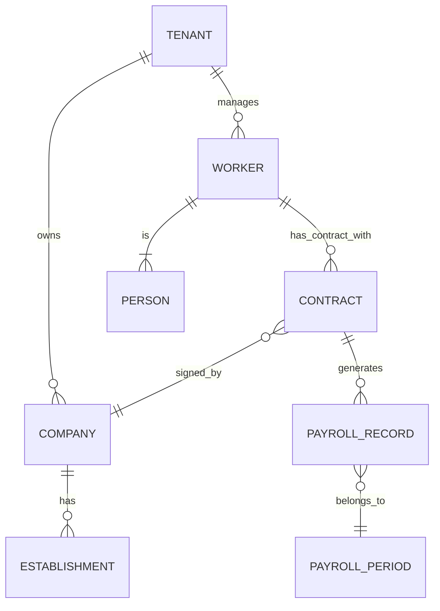

# Diagrama Entidade-Relacionamento

```mermaid
erDiagram
    TENANT ||--o{ COMPANY : "owns"
    TENANT ||--o{ WORKER : "manages"
    COMPANY ||--o{ ESTABLISHMENT : "has"
    WORKER ||--|{ PERSON : "is"
    WORKER ||--o{ CONTRACT : "has_contract_with"
    CONTRACT }o--|| COMPANY : "signed_by"
    
    CONTRACT ||--o{ PAYROLL_RECORD : "generates"
    PAYROLL_RECORD }o--|| PAYROLL_PERIOD : "belongs_to"
```

> [!NOTE]
> Este é o ERD inicial macro. Modelos detalhados (ex: Rubricas, Jornadas) serão integrados nas fases 3 e 4.
